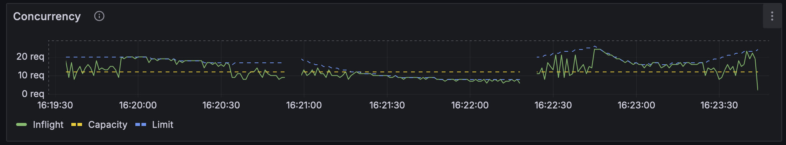
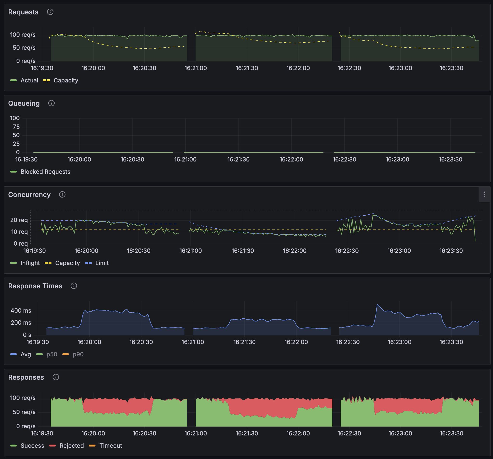
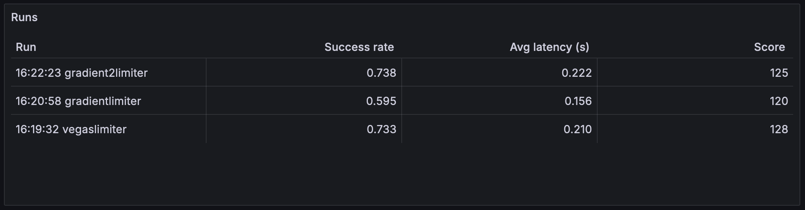

# Tripwire

A tool for testing system resilience strategies.



## Motivation

The goal of Tripwire is to help you understand how different resilience strategies such as timeouts, adaptive limiters, circuit breakers, bulkheads, and rate limiters compare to each other for different workloads and configurations.

## How it Works

Tripwire performs client/server load simulations based on some configuration, which includes request rates, service times, and server threads. Resilience strategies can be configured on the cient or server sides to handle overload, and are provided by [Failsafe-go](https://failsafe-go.dev) and [go-concurrency-limits](https://github.com/platinummonkey/go-concurrency-limits). Workloads and strategies can be run sequentially or in parallel to understand how they compare, and load can adjusted manually if desired.

## Quickstart

To observe a Tripwire run, fire up a docker-compose stack containing Prometheus and Grafana:

```sh
docker compose -f deployments/docker-compose.yml up
```

Then open the Grafana dashboard at [http://localhost:3000](). To perform a run, first build the binary:

```sh
make
```

Then run a config file, such as a staged adaptivelimiter:

```sh
./tripwire run adaptivelimiter-staged.yaml
```

The dashboard will show the simulation stages as they progress through some initial load, overload, and then back to normal again.

## Config

Tripwire configuration supports two ways of running a simulation:

- Stages, which run sequentially and last for some duration
- Workloads, which run in parallel and can be adjusted via a REST API

Stages are good for comparing how different policies and configurations compare, in terms of performance, to the same sequence of staged loads. Workloads are good for experimenting with different loads and observing how strategies behave, since they can be tweaked at runtime via the REST API.

### Stages

Stages contains a weighted distribution of service times from which the simulated servicing of each request will be selected, based on weights, which are optional. Stages allow load on a server to be gradually increased or decreased throughout a simulation. Example client config with stages:

```yaml
client:
  stages:
    - duration: 20s
      rps: 100
      service_times:
        - service_time: 50ms
    - duration: 40s
      service_times:
        - service_time: 40ms
          weight: 70
        - service_time: 80ms
          weight: 20
        - service_time: 200ms
          weight: 7
        - service_time: 500ms
          weight: 3
    - duration: 20s
      service_times:
        - service_time: 50ms
```

The `rps` and `service_times` carry over from one stage to another if they're not changed.

Each server also has a fixed number of simulated threads, which represent the max concurrency that the server can support before requests start queueing. Example server config:

```yaml
server:
  threads: 8
```

With staged testing, Tripwire will run the specified client and server stages against each strategy *sequenially*. This allows you to compare how different strategies perform against some load. An example strategies config:

```yaml
strategies:
  - name: client timeout
    client_policies:
      - timeout: 300ms

  - name: client circuitbreaker and timeout
    client_policies:
      - circuitbreaker:
          failure_rate_threshold: 10
          failure_execution_threshold: 100
          failure_thresholding_period: 5s
          delay: 5s
      - timeout: 300ms
```

See the [policy config definitions](https://github.com/jhalterman/tripwire/blob/main/pkg/policy/config.go) for more on their options, and see the [configs](configs) directory for complete example configs.

### Workloads

While stages are executed sequentially, workloads are executed in parallel, run indefinitely, and can be adjusted via a REST API. Example client config with workloads:

```yaml
client:
  workloads:
    - name: writes
      rps: 100
      service_times:
        - service_time: 50ms

    - name: reads
      rps: 20
      service_times:
        - service_time: 100ms
```

Then you can adjust the workloads via a REST API:

```sh
curl -X POST http://localhost:9095/client/workloads --data-binary @- <<'EOF'
- name: writes
  rps: 100
  service_times:
    - service_time: 20ms

- name: reads
  rps: 20
  service_times:
    - service_time: 70ms
EOF
```

Some example requests are also available in a [Bruno collection](https://github.com/jhalterman/tripwire/blob/main/bruno/tripwire.json). When using workloads, Tripwire will run through any specified strategies *in parallel*. This allows you to observe the impact of load changes on multiple strategies at the same time, which can be individually selected on the [Tripwire dashboard](#dashboard).

### Server Threads

To dynamically adjust server capacity, simulating a system degredation, you can use a REST API:

```sh
curl -X POST http://localhost:9095/server --data-binary @- <<'EOF'
threads: 8
EOF
```

## Dashboard

To observe how strategies perform in terms of request rates, queueing, concurrency, response times, and load shedding, Tripwire provides a Grafana dashboard with various metrics:



It also includes a summary of how runs for different strategies compare, including a score, which compares success rates and latencies between strategies:



When running multiple workloads, you can select a specific strategy to view results for:


